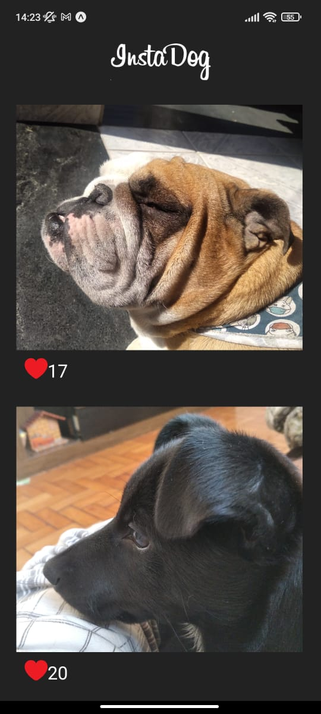

## :dog: InstaDog
 Mostre pro mundo o quão lindo é seu dogginho 
 
## :iphone: Screenshots
 

  

 
## 💻 Projeto

Aplicativo Clone do Instagram 
## ✨ Tecnologias

Esse projeto foi desenvolvido com as seguintes tecnologias:

- [React Native](https://reactnative.dev/)
- [Javascript](https://www.javascript.com/)
- [Expo](https://expo.io/)

## 📄 Licença

Esse projeto está sob a licença MIT. Veja o arquivo [LICENSE](LICENSE.md) para mais detalhes.

---

Feito por Alisson Emidio 👋🏻
